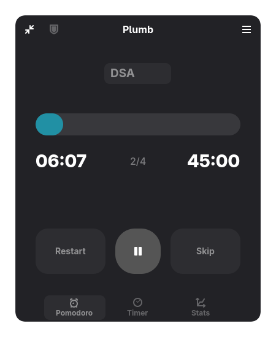

Under development and NOT ready yet.

<div align="center">
  
   
  <h1>Plumb</h1>
  <p><b>A hyper-focused, beautifully designed Pomodoro timer for GNOME that enforces strict discipline.</b></p>

  <a href="https://flathub.org/apps/io.github.tanaybhomia.Plumb">
    
  </a>
  <a href="https://ko-fi.com/tanaybhomia">
    
  </a>
  <br><br>
  
  <a href="#"></a>
  <a href="#"></a>
  <a href="#"></a>
  <a href="https://github.com/tanaybhomia/Plumb/stargazers"></a>
  <a href="https://flathub.org/apps/io.github.tanaybhomia.Plumb"></a>
  <br><br>
</div>

<div align="center">
  
</div>


Plumb is a focused productivity application built natively for the GNOME desktop environment using GTK4 and Libadwaita. It goes beyond standard Pomodoro timers by introducing strict mechanisms designed to prevent cheating and enforce true deep work.

## Why Plumb?

Most pomodoro timers are just simple countdowns. Plumb is designed with the "Submerge" productivity philosophy in mind, stopping you from cheating yourself out of focus time.
- **Submerge Discipline**: The ultimate "commit or quit" setting. When activated, you cannot pause or skip a session. You must either finish the 25 minutes or hit "Give Up" to discard the entire session completely.
- **Seamless Distraction Blocking**: Plumb can automatically restrict access to distracting websites the second a Pomodoro starts, and instantly unblock them when you take a break.
- **Deep GNOME Integration**: Plumb feels at home on Linux. It automatically puts your desktop in Do Not Disturb mode when focusing and creates full-screen Break Overlays to physically force you away from the screen when it's time to rest.

## Core Features

- **Submerge Mode**: A strict, custom deep-sea themed mode where skipping and pausing are disabled, ensuring uninterrupted focus.
- **Native Web Blocker**: Block distracting websites (like Reddit or Twitter) system-wide automatically during focus sessions, powered by a seamless, one-time setup Polkit integration.
- **Break Overlays**: When a break starts, a fullscreen overlay forces you to stop working. It flawlessly supports multi-monitor setups and displays motivational quotes.
- **Compact Mini-Player**: Minimize the window into a sleek, floating mini-player that dynamically adapts to your Light/Dark system theme while you work.
- **Project Tracking**: Manage different projects from a dedicated Preferences tab and automatically log your focused time for each, backed by a local SQLite database.
- **Do Not Disturb Sync**: Automatically silences system notifications during focus sessions and restores them during breaks.

## Installation

Plumb is officially distributed through Flathub, making it easy to install on any Linux distribution.

```bash
flatpak install flathub io.github.tanaybhomia.Plumb
```

## Contribution & Development

If you'd like to contribute to Plumb or build your own version, we have set up scripts to make local development frictionless.

### Local Testing
You do not need to install the app or compile it with Meson just to test Python code changes. Run the following command in the project root to instantly launch the app from the source code:
```bash
./run.sh
```

### Development Environment Setup
If you want to use the official Flathub release for your daily work, but also want a separate development version of Plumb in your app launcher for testing, run:
```bash
./install-dev.sh
```
This script creates a separate "Plumb (Development)" entry in your GNOME app grid. It uses a custom development icon and saves your test databases to a completely isolated folder, keeping your official Flatpak data safe. Any code changes you make in your IDE will instantly be reflected the next time you click the Development app icon.

## Architecture

Plumb follows the GNOME Human Interface Guidelines (HIG) perfectly. It utilizes native Libadwaita widgets, Adwaita preferences windows, and leverages Polkit for secure, password-less `/etc/hosts` manipulation.

## License

Plumb is free and open-source software licensed under the **GNU General Public License v3.0** (GPL-3.0). See the [LICENSE](LICENSE) file for more details.

## Stargazers

Thank you to everyone who has starred the repository and supported the project!
<a href="https://www.star-history.com/?repos=tanaybhomia%2FPlumb&type=timeline&legend=top-left">
 <picture>
   <source media="(prefers-color-scheme: dark)" srcset="https://api.star-history.com/chart?repos=tanaybhomia/Plumb&type=timeline&theme=dark&legend=top-left" />
   <source media="(prefers-color-scheme: light)" srcset="https://api.star-history.com/chart?repos=tanaybhomia/Plumb&type=timeline&legend=top-left" />
   
 </picture>
</a>
